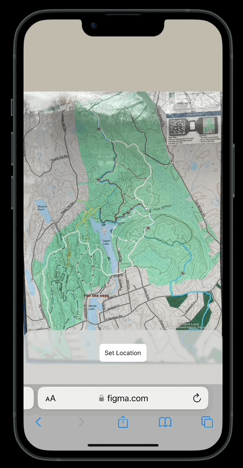

# ⛰️ Trailhead 🗺️

Alltrails, Gaia GPS, and even Google Maps provide a huge library of GPS-enabled maps you can use _if you prepare ahead of time._ If you forget to download the trail before you leave the house or you choose a new trail, you're out of luck. You take a picture of the trail map at the trailhead and try to keep track of your progress as you walk, but I often lose my place.

Trailhead turns any image into a GPS-enabled map: it provides a pin that shows your current location as you walk.

Just a few setup steps:

1. At the trailhead, select your current position on the map.
2. Walk to the first fork in the trail, and select your current position on the map.
3. That's it! Enjoy the hike!

### Demo



## Roadmap

1. ➡️ Prototype Low-Bandwidth Online Version
2. Support Offline Mode
3. Research and Prioritize Features

### 1 - Prototype a Low-Bandwidth Online Version

I'm most familiar with building applications in React, so I'll build a simple web app to prototype the user experience and calibration logic.

This approach misses the most important use case for the app, offline use, but prototyping should be much faster than if I needed to learn new tech at the same time. If we keep the payload light, it may still be useful in low-bandwidth settings.

### 2 - Support Offline Mode

Trailhead becomes truly useful once it operates offline. I'll likely implement this with a Progressive Web App (PWA), so we leverage as much of the existing functionality as possible.

### 3 - Research and Prioritize Features

With a basic prototype in hand, we determine what's important to build next.

Some things to prioritize are—

- Feature - Rectify User-provided Images (i.e. Integrate Geo-rectification tooling, like [Mapwarper](https://github.com/timwaters/mapwarper))
- Feature - Share Maps
- Exploration - Do more calibration points increase accuracy?
- Exploration - Is the location accuracy of a native app different than a PWA?
- Feature - Location Smoothing (i.e. handle temporary decreases in GPS accuracy)

# Develop

Want to host Trailhead yourself?

## Getting Started

First, run the development server:

```bash
npm run dev
# or
yarn dev
# or
pnpm dev
```

Open [http://localhost:3000](http://localhost:3000) with your browser to see the result.
